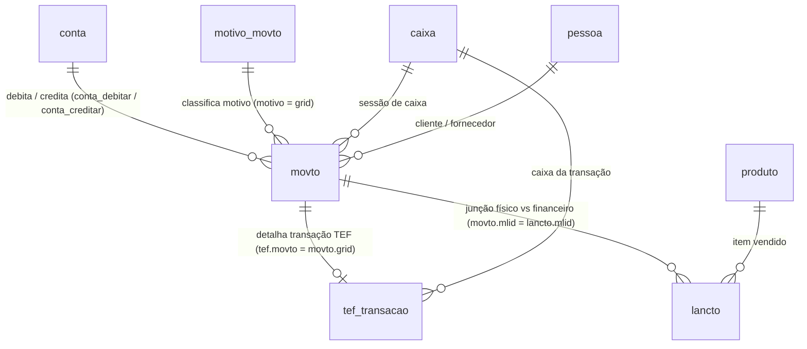

# Análise Detalhada do Schema PostgreSQL (Sistema Autosystem)

Documentação técnica extraída e mapeada a partir do dump oficial `schema.sql` (PostgreSQL v13), contendo a estrutura das tabelas centrais que alimentam os módulos de **Balancete**, **Fechamento de Caixa**, **Contas a Pagar / Contas a Receber**, **Vendas** e **TEF (Cartões)**.

---

## 📌 Visão Geral do Banco de Dados

* **SGBD**: PostgreSQL (Versão 13.x)
* **Total de Tabelas Mapeadas no Schema**: 2.227 tabelas.
* **Modelo Contábil**: Partidas Dobradas (débito/crédito por movimentação).
* **Vínculo Físico x Financeiro**: A chave `mlid` (Master Lançamento ID) conecta os itens físicos vendidos (`lancto`) às movimentações financeiras contábeis (`movto`).

---

## 🗂️ Estrutura Detalhada das Tabelas Centrais

### 1. 🟢 `movto` — Movimentações Financeiras e Partidas Dobradas
Tabela central da escrituração financeira. Cada registro representa uma movimentação monetária de entrada ou saída.

| Coluna | Tipo de Dado | Restrição | Descrição / Regra de Negócio |
|---|---|---|---|
| **`grid`** | `bigint` | **PK** | Identificador único e sequencial da movimentação. |
| **`empresa`** | `bigint` | **FK** / `NOT NULL` | Código GRID da filial/empresa. |
| **`data`** | `date` | `NOT NULL` | Data do lançamento contábil. |
| **`hora`** | `timestamp(0)` | | Data e hora exata da operação. |
| **`turno`** | `smallint` | | Número do turno do caixa (0, 1, 2...). |
| **`seq`** | `smallint` | | Sequencial dentro do turno/lote. |
| **`motivo`** | `bigint` | **FK** / `NOT NULL` | Vinculado a `motivo_movto.grid` (classificação da movimentação). |
| **`conta_debitar`** | `text` | `NOT NULL` | Código da conta contábil debitada (ex: `1.1.01.01` - Caixa). |
| **`conta_creditar`** | `text` | `NOT NULL` | Código da conta contábil creditada (ex: `1.3.01.01` - Vendas). |
| **`pessoa`** | `bigint` | **FK** | Código do Cliente ou Fornecedor (`pessoa.grid`). |
| **`documento`** | `text` | | Número do documento (Nota Fiscal, Cupom, Boleto, Cheque). |
| **`tipo_doc`** | `text` | | Tipo do documento (ex: `'NF'`, `'CHQ'`, `'DIN'`, `'DUP'`). |
| **`valor`** | `double precision`| | Valor monetário total do lançamento. |
| **`mlid`** | `bigint` | | **Master Lançamento ID**: Chave de junção com `lancto.mlid`. |
| **`lote`** | `integer` | | Lote de fechamento ou integração. |
| **`parent`** | `bigint` | | GRID do lançamento pai (em casos de desdobramento). |

---

### 2. 💳 `motivo_movto` — Formas de Pagamento e Motivos Financeiros
Define as regras de negócio para cada tipo de entrada, saída ou forma de recebimento.

| Coluna | Tipo de Dado | Restrição | Descrição / Regra de Negócio |
|---|---|---|---|
| **`grid`** | `bigint` | **PK** | Código único do motivo. |
| **`codigo`** | `integer` | | Código numérico legível do motivo. |
| **`nome`** | `text` | `NOT NULL` | Nome descritivo (ex: `'DINHEIRO'`, `'CARTAO CREDITO'`, `'DEPOSITO'`). |
| **`forma_pgto`** | `boolean` | | `true` se for uma forma de pagamento oficial em vendas. |
| **`tipo_cartao`** | `integer` | | `0` = Crédito, `1` = Débito. |
| **`troco`** | `boolean` | | `true` se representar entrega ou recebimento de troco. |
| **`a_cobrar`** | `boolean` | | `true` se for venda faturada a prazo. |
| **`conta_debitar`** | `text` | | Conta contábil debitada sugerida por padrão. |
| **`conta_creditar`**| `text` | | Conta contábil creditada sugerida por padrão. |
| **`tabela_preco`** | `bigint` | **FK** | Tabela de preço padrão associada ao motivo. |

---

### 3. 💳 `tef_transacao` — Transações de Cartão e TEF
Armazena a reconciliação das transações processadas nas maquininhas de cartão / PINPad.

| Coluna | Tipo de Dado | Restrição | Descrição / Regra de Negócio |
|---|---|---|---|
| **`grid`** | `bigint` | **PK** | Identificador único da transação TEF. |
| **`movto`** | `bigint` | **FK** | Vinculado a `movto.grid`. |
| **`caixa`** | `bigint` | **FK** / `NOT NULL` | Vinculado a `caixa.grid`. |
| **`operacao`** | `text` | | Tipo da operação: `'CREDIT'`, `'DEBIT'`, `'VOUCHER'`. |
| **`bandeira`** | `text` | | Nome da bandeira (`'VISA'`, `'MASTERCARD'`, `'ELO'`, `'GOODCARD'`, `'EXPERS'`). |
| **`operadora`** | `integer` | | Código da credenciadora/adquirente. |
| **`operadora_nome`**| `text` | | Nome da adquirente (Cielo, Rede, Stone, PagSeguro). |
| **`valor`** | `double precision`| | Valor aprovado da transação. |
| **`nsu`** | `text` | | Número de Sequência Único (NSU) da transação. |
| **`autorizacao`** | `text` | | Código de autorização da operadora. |
| **`qtd_parcela`** | `integer` | | Quantidade de parcelas do cartão. |

---

### 4. 📊 `conta` — Plano de Contas Contábil e Financeiro
Estrutura hierárquica do plano de contas da empresa.

| Coluna | Tipo de Dado | Restrição | Descrição / Regra de Negócio |
|---|---|---|---|
| **`codigo`** | `text` | **PK** | Código sintético/analítico (ex: `1.1.01.01`, `1.2.01.01`, `2.1.01.01`). |
| **`pai`** | `text` | | Código da conta pai na hierarquia contábil. |
| **`nome`** | `text` | `NOT NULL` | Nome descritivo da conta (`'CAIXA GERAL'`, `'BANCO DO BRASIL'`). |
| **`credor`** | `boolean` | | `true` se for de natureza credora (Passivo/Receita). |
| **`lancar`** | `boolean` | | `true` se for conta analítica que permite lançamentos diretos. |
| **`tipo_conta_receber`**| `boolean`| | Flag indicando uso no Contas a Receber. |
| **`tipo_conta_pagar`**  | `boolean`| | Flag indicando uso no Contas a Pagar. |

---

### 5. 🛒 `lancto` — Itens Físicos de Venda e Abastecimentos
Registra os produtos, mercadorias e combustíveis vendidos no PDV.

| Coluna | Tipo de Dado | Restrição | Descrição / Regra de Negócio |
|---|---|---|---|
| **`grid`** | `bigint` | **PK** | ID do item físico vendido. |
| **`data`** | `date` | | Data da venda. |
| **`hora`** | `timestamp(0)` | | Data e hora do lançamento do item. |
| **`operacao`** | `text` | | `'V'` (Venda normal), `'E'` (Entrada/Troca), `'M'` (Movimentação manual). |
| **`produto`** | `bigint` | **FK** | Código do produto (`produto.grid`). |
| **`bico`** | `text` | | Código do bico (quando venda de combustível). |
| **`quantidade`** | `double precision`| | Volume em litros ou quantidade física. |
| **`preco_unit`** | `double precision`| | Preço unitário praticado. |
| **`valor`** | `double precision`| | Valor total do item. |
| **`encerrante`** | `double precision`| | Leitura do encerrante do bico no momento do abastecimento. |
| **`mlid`** | `bigint` | | **Master Lançamento ID**: Liga o item físico ao `movto.mlid`. |

---

### 6. 📥 `caixa` — Controle de Turnos e Caixas de Operadores

| Coluna | Tipo de Dado | Restrição | Descrição / Regra de Negócio |
|---|---|---|---|
| **`grid`** | `bigint` | **PK** | ID único da sessão de caixa. |
| **`empresa`** | `bigint` | **FK** / `NOT NULL` | Filial do caixa. |
| **`data`** | `date` | | Data de abertura do caixa. |
| **`turno`** | `integer` | | Turno de trabalho (1, 2, 3...). |
| **`pessoa`** | `bigint` | **FK** | Operador responsável pelo caixa (`pessoa.grid`). |
| **`abertura`** | `timestamp(0)` | | Data/hora de abertura. |
| **`fechamento`** | `timestamp(0)` | | Data/hora de encerramento. |
| **`conferencia`** | `timestamp(0)` | | Data/hora da conferência final do caixa. |

---

## 🔗 Diagrama de Relacionamento Entre Tabelas (ERD)

---

## 🎯 Validação dos Scripts SQL do Projeto

A análise do `schema.sql` confirma a exatidão das consultas criadas no repositório:

1. **`Sql Balancete Gerar Resumo em 16092026.txt` (Opção A)**:
   * **Validação**: As junções `movto m JOIN motivo_movto mm ON m.motivo = mm.grid LEFT JOIN tef_transacao t ON t.movto = m.grid` utilizam exatamente as chaves de relacionamento do modelo oficial do Autosystem.
2. **`Sql Balancete Gerar Resumo em 16092026.txt` (Opção L)**:
   * **Validação**: As junções `movto m JOIN conta c ON m.conta_debitar = c.codigo` e `m.conta_creditar = c.codigo` respeitam o plano de contas e o livro-razão por partidas dobradas.
3. **`fechamento_por_periodo.sql` e `fechamento_autosystem.xml`**:
   * **Validação**: Todos os 12 Datasets utilizam colunas nativas presentes no `schema.sql`.
